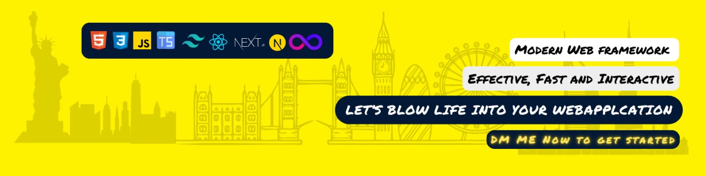

<h1 align="center">Hi 👋, I'm Haseeb</h1>
<h3 align="center">A Passionate Software Developer</h3>

  

From Software Engineer at LMKR to Full Stack Developer at Educative and Frontend Developer at xiQ, my journey is woven with a commitment to excellence and a passion for technology. Beyond coding, I bridge the gap between tech and practical solutions, utilizing skills in React.js, TypeScript, .NET CORE, and Python. With a track record in startups, entrepreneurship, and ethical engagement, I aim to empower businesses, fostering growth and innovation. My  mission is to provide cutting-edge technology solutions and ethical leadership in the ever-evolving tech landscape. Let's work together !

  
  
  
  
  
  
  
  
  
  
  

  

<h3 align="left">Languages and Tools:</h3>

- Frontend

  

- Backend

  

- Database

  

- Cloud Servers

  

- Tools

  

- 🔭 I’m currently working on **React and Next Js Applications**

- 👯 I’m looking to collaborate on **building Web Applications**

- 💬 Ask me about **Full Stack Development, Front End and React**

- 📫 How to reach me **haseebijazi150172@gmail.com**

- ⚡ Fun fact **I think I am a Magical Being :)**

<h3 align="left">Connect with me:</h3>

